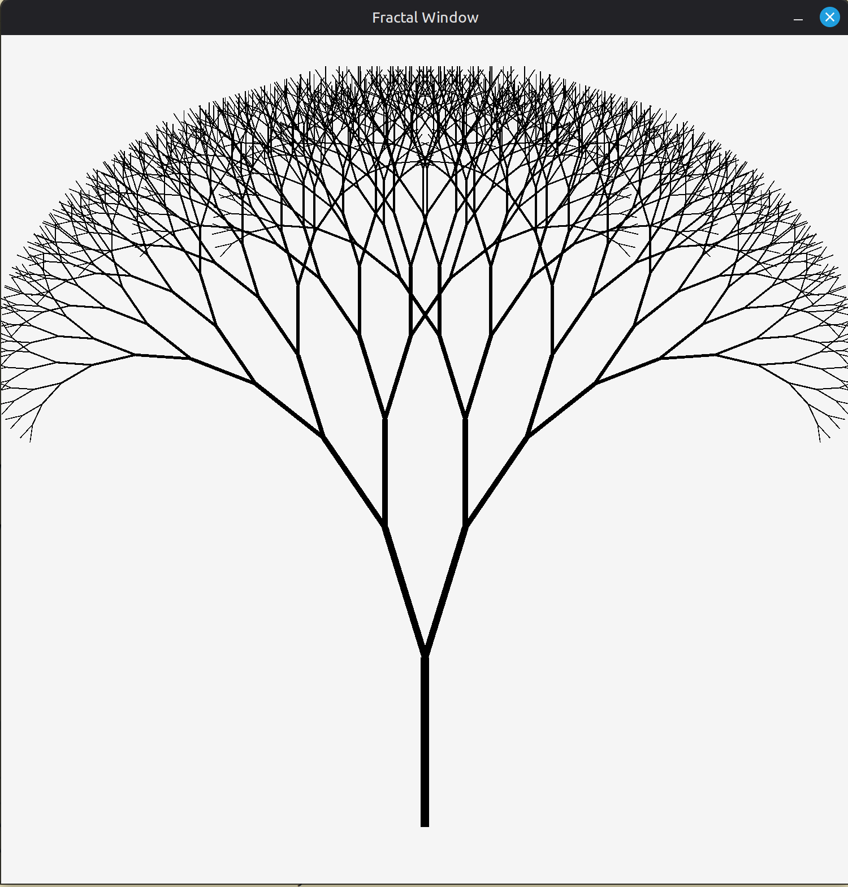

# Fractal Tree

A recursive binary fractal tree renderer built in C using [raylib](https://www.raylib.com/). Each branch splits into two children at a configurable angle, with length and thickness tapering across n generations.



---

## Features

- Recursive `DrawBranch` function with configurable depth
- Adjustable branch angle, reduction factor, and thickness
- All parameters exposed as `#define` constants — easy to tweak

---

## Prerequisites

- **C compiler** — GCC, Clang, or MSVC
- **raylib** — [installation guide](https://github.com/raysan5/raylib#build-and-installation)

---

## Building

### Linux / macOS

```bash
gcc main.c -o fractal -lraylib -lm
./fractal
```

### Windows (MinGW)

```bash
gcc main.c -o fractal.exe -lraylib -lwinmm -lgdi32 -lopengl32 -lm
fractal.exe
```

---

## Configuration

All tuneable parameters are at the top of `main.c`:

| Constant | Default | Description |
|---|---|---|
| `WIDTH` / `HEIGHT` | `1500` | Window dimensions in pixels |
| `BASE_LENGTH` | `300` | Length of the trunk branch |
| `BASE_THICKNESS` | `15` | Thickness of the trunk branch |
| `REDUCTION_FACTOR` | `0.8` | Length/thickness multiplier per generation |
| `BASE_ANGLE` | `0` | Starting angle in radians (0 = straight up) |
| `ANGLE_INCREASE_FACTOR` | `0.3` | Angle offset added/subtracted at each split |
| `MAX_GENERATIONS` | `10` | Maximum recursion depth |
| `BACKGROUND_COLOUR` | `RAYWHITE` | Background fill colour |
| `FRACTAL_COLOUR` | `BLACK` | Branch draw colour |

### Example variations

**Wider spread** — increase the angle factor:
```c
#define ANGLE_INCREASE_FACTOR 0.6
```

**Denser canopy** — increase generations and tighten reduction:
```c
#define MAX_GENERATIONS 14
#define REDUCTION_FACTOR 0.75
```

**Leaning tree** — offset the base angle:
```c
#define BASE_ANGLE 0.3
```

---

## How it works

`DrawBranch` is a simple recursive function:

1. Computes the endpoint of the current branch from its start position, length, and angle using `sinf` / `cosf`.
2. Draws the line with `DrawLineEx`.
3. Calls itself twice — once rotating left by `ANGLE_INCREASE_FACTOR`, once rotating right — with reduced length and thickness.
4. Returns when `generation > MAX_GENERATIONS`.

The total number of branches drawn is `2^(MAX_GENERATIONS+1) - 1` (2047 at the default depth of 10).

---

## License

MIT — do whatever you like with it.